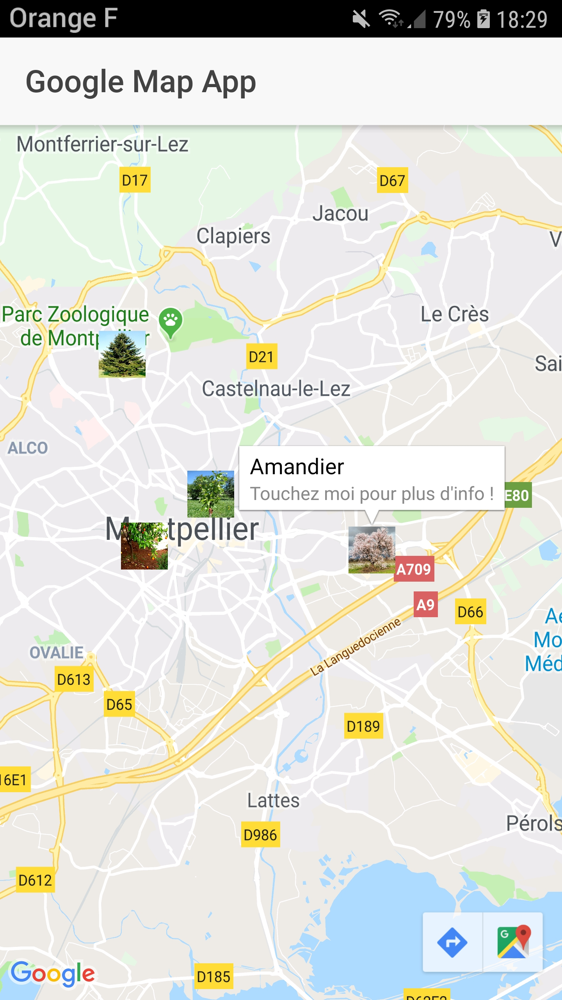

# Projet Google Maps API + Geolocation

* Google Maps Native API integration
* Set 4 markers create from mocks with image icon
* Get current location and focus on it when start application

## /!\ Notes /!\
* **Need to be run on emulator or real device**
* **Don't run with livereload because of geolocation**

## Application screenshot

