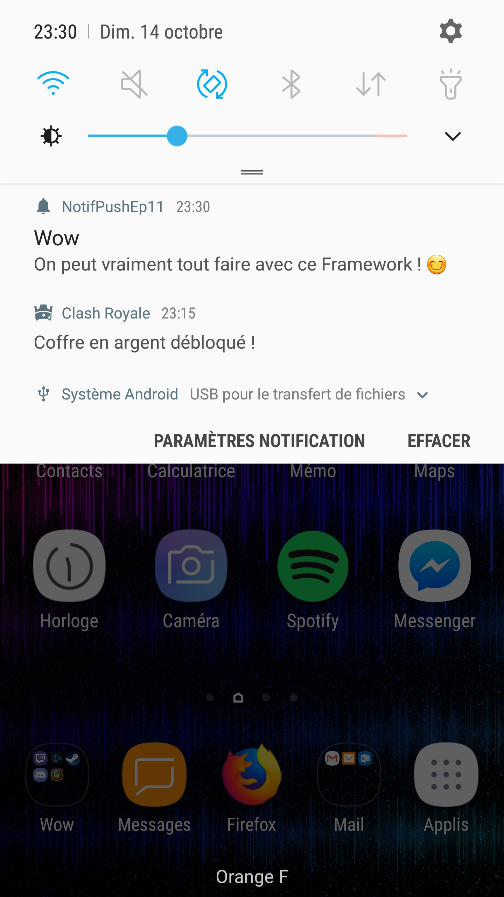

# Projet Notification Push

* Use of OneSignal website to send push notifications
* Create OneSignal.com account
* Get firebase key for our project
* Set it in our oneSignal project
* Create categories to setup notifications
* Send notifications immediately or set date and hour

# Notes
Only on real devices

# Application screenshot
