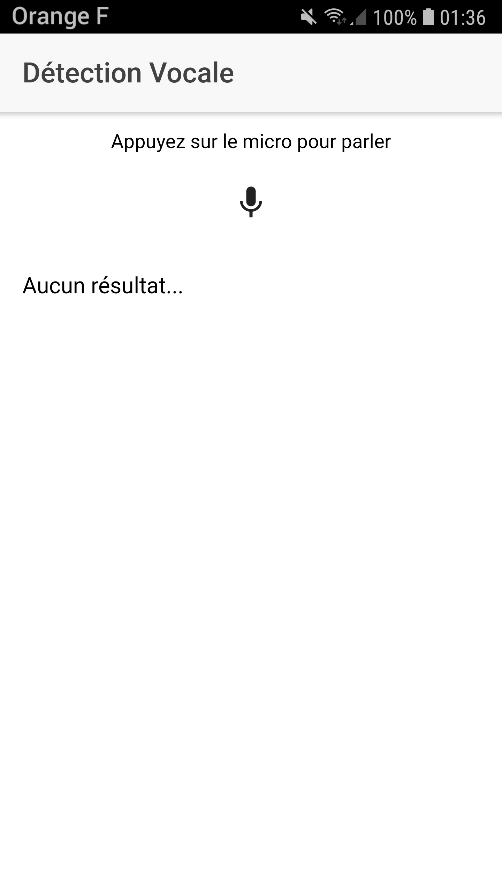
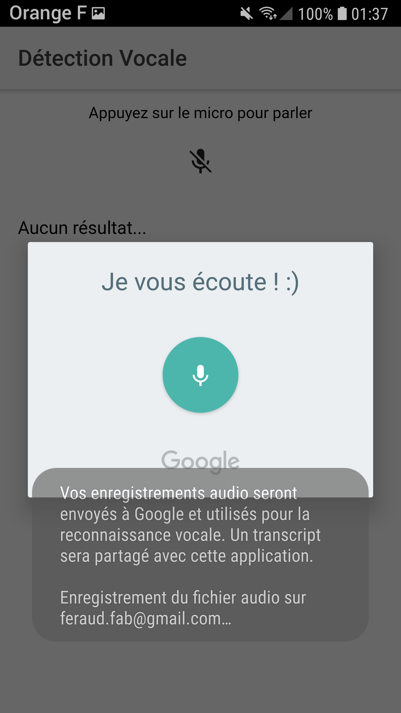
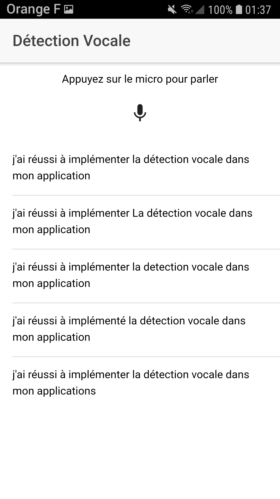

# Projet de détection vocale

* Use of native `Speech Recognition`
* Check if the application has permissions else request its
* Printing of the 5 best matches 
* Choice of the language recognition

## Notes

* Only on real device

## Application screenshots

